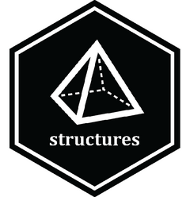

<!-- README.md is generated from README.Rmd. Please edit that file -->

```{r, include = FALSE}
knitr::opts_chunk$set(
  collapse = TRUE,
  comment = "#>",
  fig.path = "man/figures/README-",
  out.width = "100%"
)
```

# structures 

<!-- badges: start -->
<!-- badges: end -->

An R package for working with **3D molecular structures** in R.

`structures` provides:

- The **`Molecule3D`** class for representing molecules with atoms, bonds, and 3D coordinates  
- A parser for the `.mol2` file format  
- Tools for transforming and manipulating molecular geometry  
- A complete system for attaching and transforming **point-group symmetry elements**  
- A growing set of geometric and atom connectivity utilities  

---

## Installation

You can install the development version of **structures** like so:

```r
if (!require("remotes"))
  install.packages("remotes")

remotes::install_github("selkamand/structures")
```

---

## Quick Start

```{r}
library(structures)

# Load a benzene structure
path <- system.file(package = "structures", "benzene.mol2")
molecule <- read_mol2(path)

print(molecule)
```

---

## Transforming Molecules


The `structures` package includes several **high-level convenience functions** for
common molecular transformations, such as:

- `translate_molecule_by_vector()`
- `rotate_molecule_around_vector()`
- `rotate_molecule_around_anchor()`
- `rotate_molecule_around_atom()`
- `scale_molecule()`
- `reflect_molecule_through_plane()`

These helpers provide simple, readable ways to apply typical rigid-body
operations without writing transformation functions yourself.

```{r}
# Translate the molecule 5 units along Y axis
molecule_shifted <- translate_molecule_by_vector(molecule, c(0, 5, 0))

# Rotate 90° around the Z-axis
molecule_rotated <- rotate_molecule_around_vector(
  molecule,
  axis = c(0, 0, 1),
  angle = pi / 2
)
```


The package also provides a unified interface for applying any transformations.

All transformations ultimately flow through a single low-level mechanism:

```{r, eval=FALSE}
transform_molecule(molecule, transformation = <function>, ...)
```

Here, `transformation(point)` must take a named numeric vector
`c(x, y, z)` and return another 3-vector. Additional arugments to transformation function can be supplied by `...` 

This makes it possible to apply any coordinate mapping - translation,
rotation, reflection, projection, distortion, or even nonlinear geometric
operations — simply by supplying your own function.


### Using the move package to transform molecules

The [move](https://github.com/selkamand/move) package contains common transformations that can plug straight into `transform_molecule`.

```{r}
library(move)

# Translate a molecule 5 units up along Y axis
molecule_shifted <- transform_molecule(
  molecule, 
  transformation = move::translate_position_in_direction, 
  direction = c(0, 1, 0), 
  magnitude = 5
)

# Rotate around the Z-axis
molecule_rotated <- transform_molecule(
  molecule,
  transformation = move::rotate_vector_around_axis,
  angle = pi / 3,
  rotation_axis = c(0, 0, 1)
)
```

## Anchors

Molecules can be tagged with an 'anchor' atom/position about which various transformations can be made.

For example, a common transformation is to translate the molecule so that a particular atom is at the origin. One easy way to achieve this is to simply set the molecules 'anchor' to the target atom and apply anchor-aware transformations like `translate_molecule_to_origin()`


```{r}
# Using anchors and higher-level helpers
molecule_centered <- molecule |>
  set_anchor_by_atom(eleno = 1) |>
  translate_molecule_to_origin()
```

---


## Geometric analysis: molecular planes

In addition to distances and angles, `structures` can compute **best-fit planes**
through molecular coordinates. A common use case is to get the mean plane of an
aromatic ring or ligand fragment.

`compute_plane_from_atoms()` computes a plane through all atoms in a
[`Molecule3D`] using svd fitting under the hood. If only 3 points are supplied, an exact plane will be computed using the cross-product.

```{r}
# Best-fit plane through all atoms in the molecule
plane <- compute_plane_from_atoms(molecule)

# Unit normal vector of the plane
plane$normal

# Signed offset from the origin along that normal
plane$offset
```

---

## Symmetry Elements

The `structures` package now supports all standard symmetry elements. Providing S7 Classes for:

1. Proper Rotation Axes (`ProperRotationAxis()`)
2. Improper Rotation Axes (`ImproperRotationAxis()`)
3. Mirror Planes (`MirrorPlane()`)
4. Centres of Inversion (`CentreOfInversion()`)

These elements can be added to any `Molecule3D` structure and will participate in transformations.


### Creating Symmetry Elements

```{r}
ProperRotationAxis(n = 6, posA = c(0, 0, -1), posB = c(0, 0, 1))

ImproperRotationAxis(n = 6, posA = c(0, 0, -1), posB = c(0, 0,  1), plane_point = c(0, 0,  0))

MirrorPlane(position = c(0, 0, 0), normal = c(0, 0, 1))

CentreOfInversion(position = c(0, 0, 0))
```


Any `Molecule3D` object can be annotated with these symmetry elements.

### Adding Symmetry Elements

Symmetry elements can be attached to any `Molecule3D` object using helper functions:
e.g. [`add_symmetry_element_to_molecule()`]:

```{r}

# Add a C6 symmetry axis to the benzene molecule
molecule <- add_symmetry_element_to_molecule(
  molecule,
  ProperRotationAxis(n = 6, posA = c(0, 0, -1), posB = c(0, 0, 1))
)

# Inspect updated molecule summary
print(molecule)

# Or to see a more detailed description
print(molecule@symmetry_elements)
```

The molecule keeps track of:
- all attached symmetry elements (`@symmetry_elements`),
- unique symmetry orders present (`@symmetry_axes_orders`),
- and whether any symmetry axes exist (`@contains_symmetry_axes`).

You can also retrieve all axes of a given order:

```{r}
fetch_all_proper_rotation_axes_with_order(molecule, Cn = 6)
```


### Transforming based on Symmetry Elements

Once symmetry elements have been added to the molecule we can use those to inform transformations

```{r}
# Print out available symmetry elements
as.data.frame(molecule@symmetry_elements)


# Rotate so C6 symmetry axis points right
rotate_molecule_so_symmetry_axis_aligns_with_vector(
  molecule, 
  symmetry_element_id = 1, 
  target = c(0,1,0)
)

# Rotate 30 degrees around the C6 symmetry axis
rotate_molecule_around_symmetry_axis(
  molecule, 
  symmetry_element_id = 1, 
  angle = pi/6 # 30 degrees
)
```
## Dummy atoms

mol2 files can contain dummy atoms, indicated by the `atom_type` column being "Du" / "Du.C" (see mol2 specification). These dummy atoms can be deleted.

```{r}
path <- system.file(package = "structures", "fe_dummies.mol2")
molecule_with_dummies <- read_mol2(path)
molecule_without_dummies <- remove_dummy_atoms(molecule_with_dummies)

message("Number of dummy atoms in original molecule: ", molecule_with_dummies@n_dummy_atoms)
message("Dummy atoms in molecule after deletion: ", molecule_without_dummies@n_dummy_atoms)
```

---

## Features Summary

- 🧬 `Molecule3D`: robust container for atomic and bonding data  
- 📂 `.mol2` parser (`read_mol2()`)  
- ⚙️ Coordinate manipulation (`translate_molecule_*`, `transform_molecule()`)  
- 🧭 Persistent anchors for positioning molecules  
- 🔁 **New:** Rotational symmetry support via `ProperRotationAxis` and `add_symmetry_axis()`  
- 🧩 Connectivity and geometric utilities (`fetch_eleno_*`, `compute_distance_between_atoms()`)

---

## Citation

If you use **structures** in research or publications, please cite the package using:

```{r warning=FALSE}
citation("structures")
```
